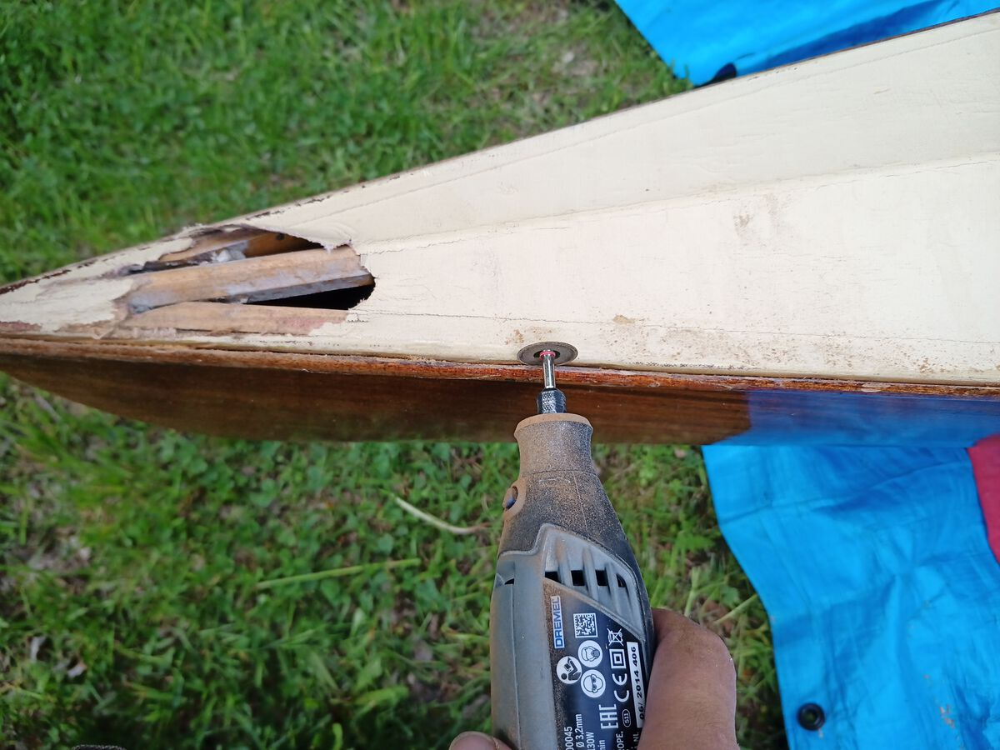
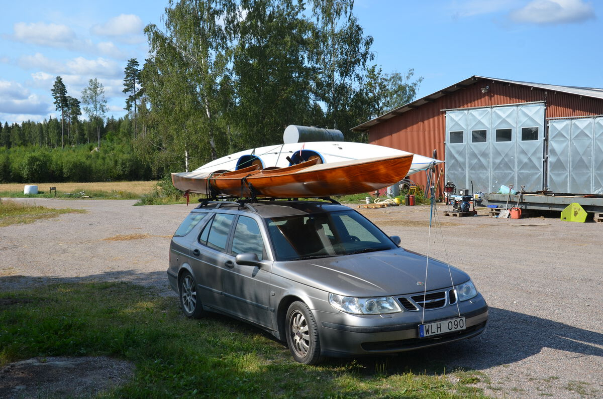

#### Renovating a vkv Anita K2 mahogany kayak from the 1960's.

###### Not being used for 20 years the upper deck was replaced and the wooden hull sandpapered and varnished.

<figure class='third'>

<figcaption>Renovating a vkv Anita K2 mahogany kayak form the 1960's.</figcaption>

</figure>
